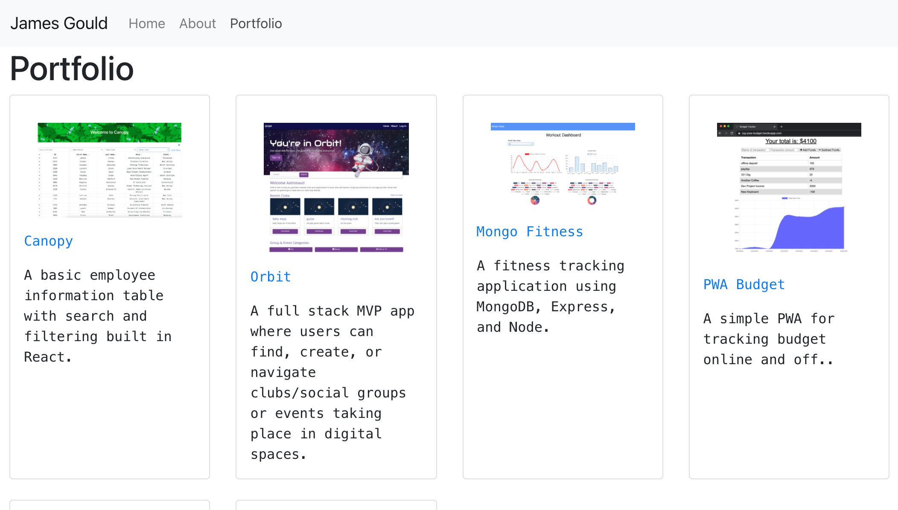

# React Portfolio

## Table of Contents

- [Installation](#installation)
- [Credits](#credits)
- [License](#license)
- [Contributing](#contributing)
- [Tests](#tests)

## Description

My personal portfolio site built in React.

## Installation

To view, navigate to the live site [here](https://nobleburgundy.github.io/react-portfolio/).

## Screenshot

## Credits

React and React Router libraries were both used in the building of this portfolio site.

- [React](http://reactjs.org/)
- [React Router](https://reactrouter.com/)

## License

Licensed under the MIT license.

## Tests

No tests available at this time

## Questions?

Please contact me via email at goul0076@gmail.com with any questions.
